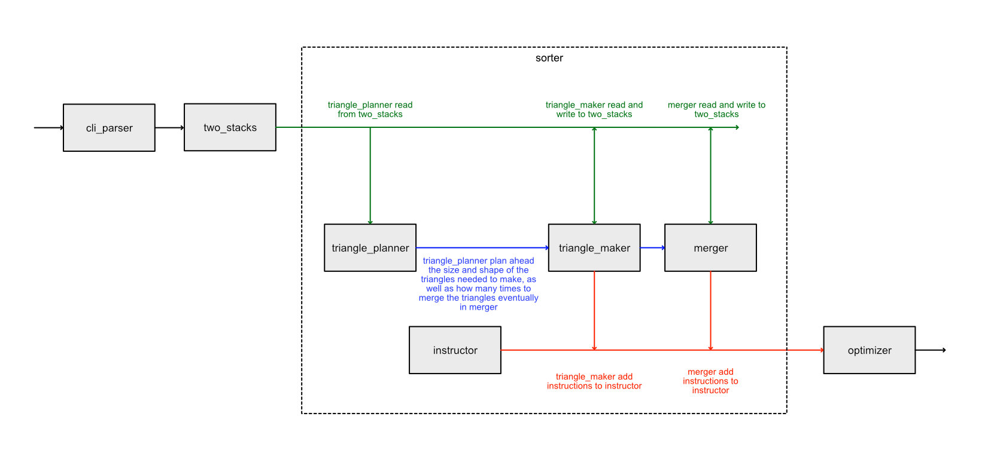

# PUSH SWAP

The project aims to generate the shortest sequence of instructions that sorts elements using two stacks. The instructions are as follows:

- sa: swap the order of first 2 elements on stack A
- sb: swap the order of first 2 elements on stack B
- ss: executes sa and sb at the same time
- ra: rotate the first element of stack A to the end of stack A
- rb: rotate the first element of stack B to the end of stack B
- rr: executes ra and rb at the same time
- rra: rotate the last element of stack A up the start of stack A
- rrb: rotate the last element of stack B up the start of stack B
- rrr: executes rra and rrb at the same time
- pa: pushes the first element of stack A to the starts of stack B
- pb: pushes the first element of stack B to the starts of stack A

All elements first starts in stack A, and they have to be sorted in ascending order in stack A eventually.

## Compilation

```bash
git submodule update --init
make && make clean && make bonus
```

This will compile the push_swap executable as well as the checker executable.

## Usage

All of the following is valid inputs. The rule is simply as long as you pass in non-repeating numbers.

```bash
./push_swap 1 3 2 -10 13 99
./push_swap "1 3 2 -10 13 99"
./push_swap "1 3 2" -10 "13 99"
```

Then it will generate instructions like this:

```
pb
ra
ra
pb
ra
ra
ss
pa
pa
```

The checker is used to check whether the instruction generated is correct.

It can be used like this in general:

```bash
NUMBERS="1 3 2 -10 13 99"; ./push_swap $NUMBERS | ./checker $NUMBERS
```

## Implementation

The idea is to create a certain number of small sorted elements from stack A to stack B. Each small sorted elements are named as a "triangle", because depending on the need, the elements are either sorted in ascending or descending order. Then push one third of the triangles back to stack A, and begin merging the triangles to make bigger triangles at the start of stack A. In big number of elements, this process will be repeated serveral times until it left one big ascending triangle in stack A or descending triangle in stack B. Then the job is done. For the case where the triangle is descended in stack B, the program simply needs to push all the elements from stack B to stack A to finish the job.

This idea of merging comes from this guide: [Triangle merge sort](https://80000coding.oopy.io/402024b2-13ba-447a-ac0f-0eeaf91f0e5f#402024b2-13ba-447a-ac0f-0eeaf91f0e5f). However there are a lot of details I have to fill in by myself in order to make it work. I needed to create 4 different algorithms before I can merge like in this guide:

1. An algorithm to calculate triangle shape
2. An algorithm to calculate triangle sizes
3. An algorithm to create triangles from stack A to stack B
3. An algorithm to create trangle on stack A (used for small numbers of elements and the creation of the last triangle)


